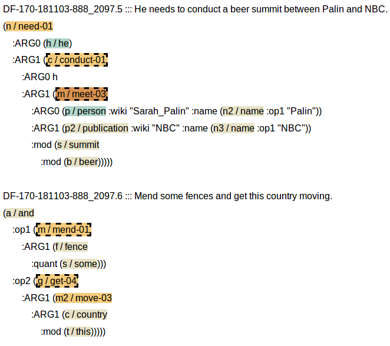
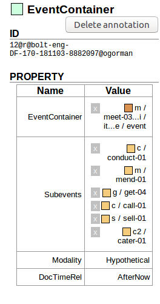
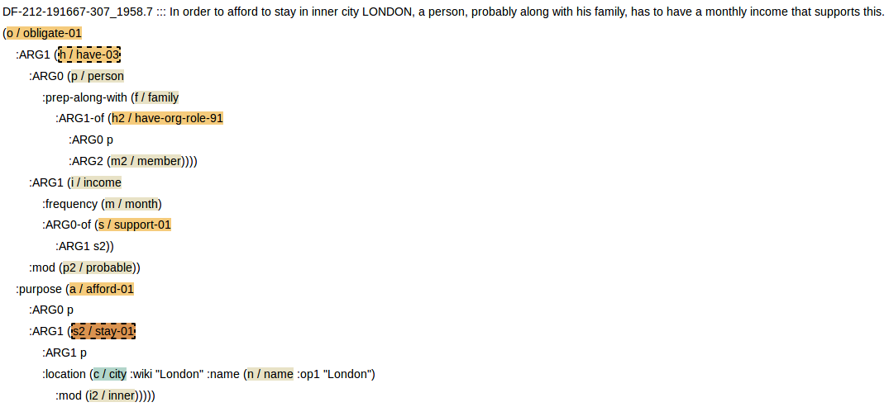
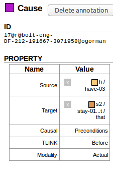

##### Richer Event Description AMR (version 0.1)

This is a very preliminary pilot of annotation of *temporal, causality and modality* information on top of AMR.  

We want to produce a rich representation of temporal structure on top of AMR.   Even more than raw text, AMR elements are lacking in information about what an "event" is, whether those events happened, or when they happened.  We need to add this information to the AMRs.  So one thing to keep in mind during annotation is that we hope to end up with an annotation where if feels like those core questions -- what are the events, did they happen, and when did they happen -- are answered relatively well. 

Our second goal with this is that our annotations need to be *scalable and accurate*.  Because of this, we will sometimes be annotating things in a rather compressed manner  -- focusing upon moments where your insight as an annotator is essential, and reducing the amount of time you spend on things that should be obvious.  

We assume that you have annotated AMRs before [(see the guidelines here for a refresher.)](https://github.com/amrisi/amr-guidelines/blob/master/amr.md).  You will also often be directed to the [guidelines for RED](https://github.com/timjogorman/RicherEventDescription), which is similar to the annotation we are doing now, but was done over text. 

# General Approach and Philosophy

#### The "Event Container" trick
We are focusing on an idea called an "Event Container".  All this really means is that we are thinking about how events have subevents, and that those subevents generally *inherit* information from their larger event. 

Imagine you have a document discussing two people going to dinner.  There may be many events there -- there might be an event or ordering a mean, a main course, there might be a situation where they pay the check.  Those events, too, might have subevents, such as fighting over the bill or finishing your meal.  One thing we are capturing is this "subevent" structure -- marking that these events are part of the larger "dinner" event.

We will also be assuming that, unless you label things otherwise, these subevents will inherit the *modality* of their containing event as well.  If someone describes an entirely hypothetical dinner, then knowing that the dinner is hypothetical generally implies that the main course of that dinner is also hypothetical.  

#### How this will relate to temporal order (before/after) and causal annotation

The goal of this annotation is to lead to a good sense of *when events happen within a document*.  Those "event containers" will provide information about which events temporally contain other events.  The other thing we will do is *efficiently* annotate how events are ordered. If we see another event -- such as "scheduling the dinner" -- we might want to annotate that that event happened before the dinner.   We don't need to explicitly label that "scheduling the dinner" happened before "eating soup" -- if we know that "scheduling the dinner" happened before "having dinner" and "having dinner" contains "eating soup", then we can infer the rest.  We will sometimes refer to this "temporal inference" as *temporal closure*.  So alongside those "event container" links you will mark temporal links -- and causal links (e.g. scheduling the dinner is a PRECONDITION on having dinner) -- but you don't need to relate everything, because so much can be inferred. 

#### How this combines with AMR

We do this on top of multi-sentence AMR.   This means that you are not labeling spans of text like "scheduling a dinner", but nodes within an AMR graph such as "schedule-01".  You do this over text that *already has coreference information*; there will be AMR nodes colored red which actually refer to a collection of different mentions of the same event.  This simplifies your task -- even if two events are mentioned many times, you only need to mark a relationship between them *once*.  

This also means that you will need to be able to read an AMR and get the same intuitions as your colleagues for what a particular predicate in AMR *means*.  For the most part, this will be easy -- look at the AMR and its corresponding sentence, and come up with an understanding of that event.  But sometimes this will be more complicated than that, especially when events start to be negated or made hypothetical.  

## Walking through a basic event annotation

#### Making an Event Container

Let's start with some actual examples of annotation.  We have two AMRs below from a discussion on the internet, where someone suggests that Barrack Obama should meet with Sarah Palin. The following figure shows an example of these sentences.  The color coding can be ignored for now; AMR elements that have Propbank frames (and are therefore likely to be events) are in orange, and AMR elements that are in event coreference chains are in red/maroon, such as "meet-03" below:

Let's say that you feel that this hypothetical meeting between Obama and Palin would contain "mending the country" and "conducting the meeting" within it.  In Anafora, we will press "e" and create an "EventContainer".  This has an "Event" box, "Subevents" box, "Doctime" menu, and "Modality" menu, and "AspectEtc" menu.  Pressing "1" would let you select the actual main event that we want to annotate (meet-03), and then clicking "2" would allow you to add subevents -- which can be added with a single click on the AMR node for "get-04", "mend-01", etc.  If you click on the modality and DocTime labels (or use shortcuts "3" and "4"), you can make this a hypothetical, future event:

Note that if all we need to encode about these seven events is that they are all hypothetical events in the future under this "meeting" event, then this is all you need to annotate -- an event like"mend-01" doesn't need a separate "event container", because we can already tell that it's an event and what it's modality is.  However, if you wanted to, you could give them separate event container objects, with empty "subevent" boxes.  This will be important if one event in a hierarchical event structure has a separate modality than the others, for example.  

Moreover, another event could contain this "meet-03" event as a subevent.  If you had a sentence like "He could do it during his visit to Alaska next year", you would great an event container to represent that visit to Alaska, and add the 'meet-03' element as a subevent. 

##### Adding temporal and causal relations

Let's say that you want to mark a temporal relation marking whether one event is before or after another event (we can also encode more complicated relations: whether an event "begins on" or "ends on" another event, or whether the event is simply overlapping with another event), or a causal relation with temporal information. For example, a particular event/situation (having a certain income) might be a precondition upon another event/situation (living in London):

We simply want to relate these two, mark whether there is a causal relation, and label the temporal order and modality of the relation.  We will add one of two relations -- "TemporalOrder" (for non-causal relations, shortcut "t") or "Cause" (for causal relations, shortcut "c"), add one AMR variable for the SOURCE and TARGET role, and select answers for the "Causal", "TLINK" (temporal relation type) and "modality" boxes, as shown below:

## Details

#### So How are we defining events (eventualities)?

We will follow RED guidelines for defining what counts as an event; If you haven't annotated documents with Richer Event Description, read the rules for [What counts as an event](https://github.com/timjogorman/RicherEventDescription/blob/master/guidelines.md#what-is-an-event).  There are a few additional edge cases to focus on in AMR:

**Events that characterize participants**: Because AMR decomposes words like "teacher" and "protester" into their component parts, we have direct access to the events implied by those nouns.  These are events **only if** they refer to specific events.  Simple test -- if you could add additional context that implies that the event never actually happens, then it's definitely not an event.  E.g. you might say "He's a math teacher now, but hasn't successfully taught anyone math yet", or "the new firefighter has yet to fight any fires".  This means that most relational nouns will **not** be events, but keep an eye out for moments when they actually refer to a specific event, such as  "9/11 first responders" or "Grammy winner Rob Thomas"

**Properties**: We have lots of predicates referring to states.  Claiming that things are "good", "sad", "happy", etc.  When are these "events"?  We generally say that they are NOT events when they simply add information about an entity, rather than implying a separate situation.  However, there will be exceptions, and if these are clearly involved in temporal and causal relations, you want to annotate them as events. 

**Relations and Negations**: Cause-01 is not an event for our purposes!  Also, markers of negation, likelihood, or possibility --"possible-01",  "didn't choose to", "didn't bother with", etc. -- aren't real events, even if they are realized with Propbank predicates.

#### Event Coreference:

Remember that the events that are colored more darkly have multiple mentions.  These are EVENT CHAINS.   You don't need to do event coreference (it's already done), and each "event chain" will act as a single entity -- so you don't need to label it multiple times.  If you need to know what relations you have already annotated in that Event, you can just click on any mention, and it will show the relations already annotated. 

#### Shortcuts

There are many alternative items that have different names from "EventContainer", such as "HypotheticalBefore".  These are *purely for annotator convenience and annotation speed*; they are versions of "EventContainer" that have different defaults, so that instead of pressing "e" to creat an "EventContainer" and selecting a Hypothetical modality and DocTimeRel of "before", you can 
In reality, instead of using "EventContainer", you want to use a bunch of other relations that are *exactly the same* as Event Container, but which have different default arguments.  If you see an event that didn't actually happen, you should be able to label that with three quick motions --- pressing  "n", pressing "1", and clicking on the event you are negating.  

## Causal and Temporal Link Details

These work just as described in the RED annotation, so review the "Definitions and Prototypes of the TLINK subtypes" discussed at: https://github.com/timjogorman/RicherEventDescription/blob/master/guidelines.md#definitions-and-prototypes-of-the-tlink-sub-types .  The only major difference in RED+AMR is that when something has already been annotating with AMR causal and temporal links using :time or cause-01, we *don't* need to explicitly label them again! That means that there will often be very few causal and temporal relations that you actually need to annotate in the data, and that's fine. 

